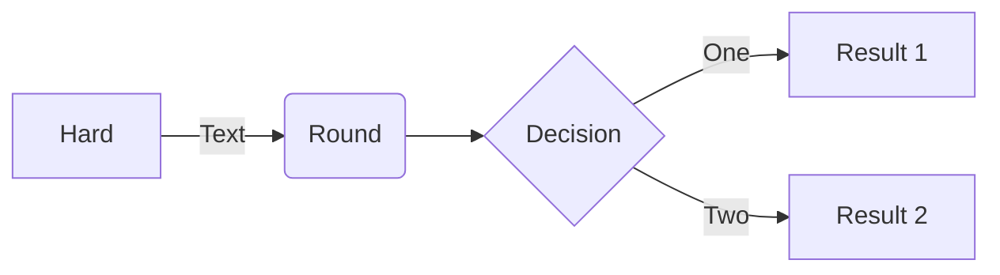

Project Organization and Data Management
========================================

Based on:

- [Project Organization and Management for Genomics][dc_orggen]
- [Cookiecutter Data Science][cc_ds]
- [A Quick Guide to Organizing Computational Biology Projects][quick_compbio]

Topics
=======

1. What do you want your project directory to store?
    - Lab protocols
    - Primary data, including images 
    - Lists of specimens and reagents 
    - Information about instruments
    - data
    - code
    - documentation
    - tests
1. Conceptual model of your project
    - Where do things go? ... GTD Archive - Use the most obvious "identifier",
      eg, you should be able to find it by looking in at most 2 places.
1. README
1. Project Directory structure
    - an example project directory
    - talk about the files and directories ...
        - README.md
        - .git
        - data
        - code (src)
        - documentation (docs)
        - tests
1. Data categories
    - metadata (data about the experiment; machine or human generated, immutable)
    - raw data (machine generated, immutable)
    - third-party (human generated, immutable)
    - derived (outputs)
    - data dictionaries
1. Data best practices
    - machine generated vs human generated (eg, Excel spreadsheets)
    - naming conventions: unique identifiers for samples
        - see "making-the-right-moves-second-edition.pdf" p 149 for examples
    - unique identifiers for samples
    - about spreadsheets
1. Example: Genomics Core Sequencing data
1. Example: NCBI SRA Data
1. Example: Something more stats/data-science oriented

Test diagram
============

Attribution
===========

Portions of this workshop are derived from the [Data Carpentries'][dc_home]
workshop "[Project Organization and Management for Genomics][dc_orggen]"
(Copyright (c) The Carpentries) which is made available under the [Creative
Commons Attribution license 4.0][cc40].

<!-- LINKS -->

[cc40]: https://creativecommons.org/licenses/by/4.0/
[cc40l]: https://creativecommons.org/licenses/by/4.0/legalcode
[dc_home]: https://datacarpentry.org/
[dc_orggen]: https://datacarpentry.org/organization-genomics

[]: https://datacarpentry.org/organization-genomics/01-tidiness.html#data-about-the-experiment "Data about the experiment [metadata]"
[]: https://datacarpentry.org/organization-genomics/01-tidiness.html#structuring-data-in-spreadsheets "Structuring data in spreadsheets"
[cc_ds]: https://drivendata.github.io/cookiecutter-data-science/
[]: https://sciencehistory.org/education/scientific-biographies/james-watson-francis-crick-maurice-wilkins-and-rosalind-franklin/
[quick_compbio]: https://journals.plos.org/ploscompbiol/article?id=10.1371/journal.pcbi.1000424

<!-- END -->
