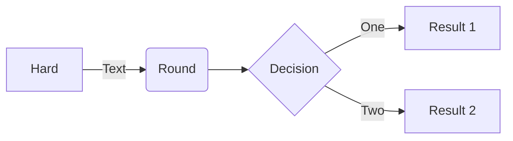

Project Organization and Data Management
========================================

> Unfortunately, for students who are preparing for a research career, [the
> typical bioinformatics and computational biology] curriculum fails to address
> many of the **day-to-day organizational challenges** associated with
> performing computational experiments. In practice, the principles behind
> organizing and documenting computational experiments are often learned on the
> fly, and this learning is strongly influenced by personal predilections as
> well as by chance interactions with collaborators or colleagues.
>
> The purpose of [this workshop!] is to describe one good strategy for carrying
> out computational experiments. I will not describe profound issues such as
> how to formulate hypotheses, design experiments, or draw conclusions. Rather,
> I will focus on relatively mundane issues such as organizing files and
> directories and documenting progress. These issues are important because
> **poor organizational choices can lead to significantly slower research
> progress.** I do not claim that the strategies I outline here are optimal.
> (Noble, 2009)

Based on:

- [Project Organization and Management for Genomics][_d]
- [Cookiecutter Data Science][_g]
- [A Quick Guide to Organizing Computational Biology Projects][_i]

Topics
=======

1. What do you want your project directory to store?
    - Lab protocols
    - Primary data, including images 
    - Lists of specimens and reagents 
    - Information about instruments
    - data
    - code
    - documentation
    - tests
1. Conceptual model of your project
    - Where do things go? ... GTD Archive - Use the most obvious "identifier",
      eg, you should be able to find it by looking in at most 2 places.
1. README
1. Project Directory structure
    - an example project directory
    - talk about the files and directories ...
        - README.md
        - .git
        - data
        - code (src)
        - documentation (docs)
        - tests
1. Data categories
    - metadata (data about the experiment; machine or human generated, immutable)
    - raw data (machine generated, immutable)
    - third-party (human generated, immutable)
    - derived (outputs)
    - data dictionaries
1. Data best practices
    - machine generated vs human generated (eg, Excel spreadsheets)
    - naming conventions: unique identifiers for samples
        - see "making-the-right-moves-second-edition.pdf" p 149 for examples
    - unique identifiers for samples
    - about spreadsheets
1. Example: Genomics Core Sequencing data
1. Example: NCBI SRA Data
1. Example: Something more stats/data-science oriented

Test diagram
============

Attribution
===========

Portions of this workshop are derived from the [Data Carpentries'][_c]
workshop "[Project Organization and Management for Genomics][_d]"
(Copyright (c) The Carpentries) which is made available under the [Creative
Commons Attribution license 4.0][_a].

References
==========

1. Noble WS (2009) A Quick Guide to Organizing Computational Biology Projects. PLOS Computational Biology 5(7): e1000424. https://doi.org/10.1371/journal.pcbi.1000424

<!-- LINKS -->

[_a]: https://creativecommons.org/licenses/by/4.0/
[_b]: https://creativecommons.org/licenses/by/4.0/legalcode
[_c]: https://datacarpentry.org/
[_d]: https://datacarpentry.org/organization-genomics
[_e]: https://datacarpentry.org/organization-genomics/01-tidiness.html#data-about-the-experiment
    "Data about the experiment [metadata]"
[_f]: https://datacarpentry.org/organization-genomics/01-tidiness.html#structuring-data-in-spreadsheets
    "Structuring data in spreadsheets"
[_g]: https://drivendata.github.io/cookiecutter-data-science/
[_h]: https://sciencehistory.org/education/scientific-biographies/james-watson-francis-crick-maurice-wilkins-and-rosalind-franklin/
[_i]: https://journals.plos.org/ploscompbiol/article?id=10.1371/journal.pcbi.1000424
    "A Quick Guide to Organizing Computational Biology Projects (Noble, 2009)"
[_k]: https://github.com/chendaniely/computational-project-cookie-cutter
    "A cookie cutter to set up a folder structure for a computational project (not affiliated with Cookiecutter software)"
[_l]: https://github.com/Reproducible-Science-Curriculum/rr-init
    "Research project initialization and organization following reproducible research guidelines"

<!-- END -->
