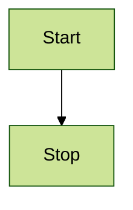

# Getting Started

<!-- THIS SLIDE BLANK -->

# What do you need to track?

- Data (raw, processed, etc)
- Scripts
- Lab protocols
- Primary data, including images 
- Lists of specimens and reagents 
- Information about instruments
- ...

# Conceptual model

# Exercise
## Draw a conceptual model

- What are your data sources?
- What are the 'preprocessing' steps?
- What are the main software programs you anticipate using?
- Does your project require complex custom code?

<!-- END -->
